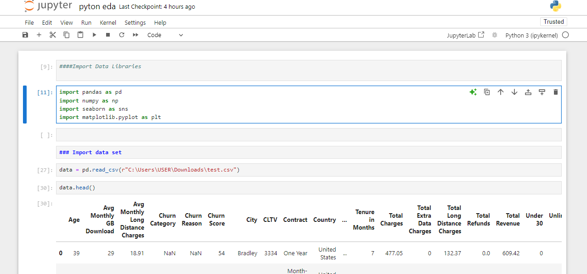
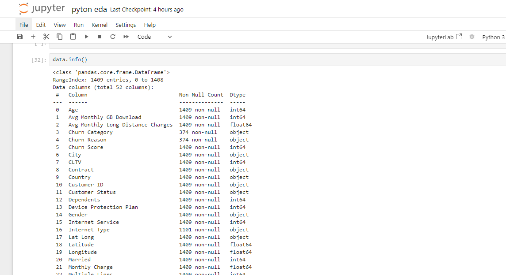
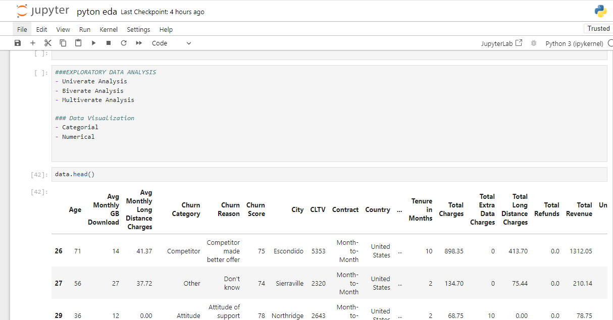
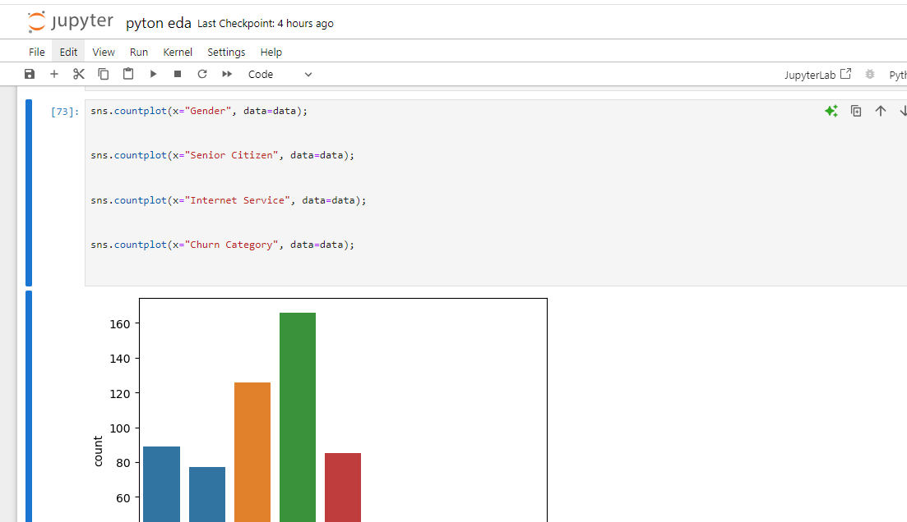
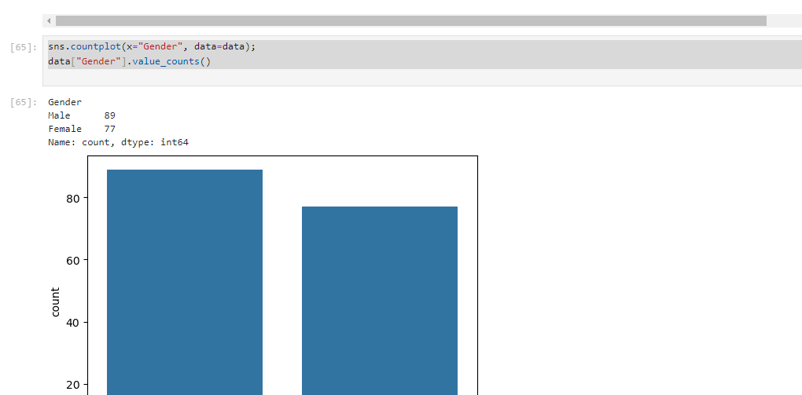
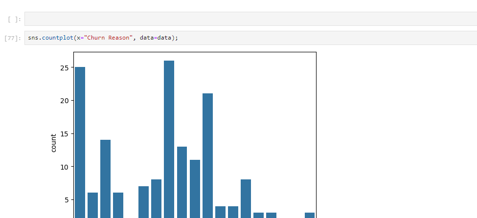

# EXPLORATORY-DATA-ANALYSIS-USING-PHYTON

### INTRODUCTION
This data sets was downloaded from kaggle.com. The aim is to explore data on why customers are not patronizing their products and the reason for the dissatisfaction. Churn Customer refers to the number of existing customers who may leave the service provider over a given period. These customers can be called as churners. The main aim of churn is to predict the churnable customers at the earliest, to identify the reason for churning.

_Disclaimer_ _This data set does not represent any company, institution or country. It is used for the sole purpose of showing the capabilities using python and how python can be used to make strategic management decisions_
____________

The data set includes information about:

- Customers who left within the last month – the column is called Churn
- Services that each customer has signed up for – phone, multi
ple lines, internet, online security, online backup, device protection, tech support, and streaming TV and movies
- Customer account information – how long they’ve been a customer, contract, payment method, paperless billing, monthly charges, and total charges
- Demographic info about customers – gender, age range, and if they have partners and dependents

__________________

Problem statement:
1. To explore which gender patronize their product more
2. To explore the age category
3. To explore the churn reason
4. To explore the churn category

___________________

Skills / concepts demostrated
- Import of Data Libraries such as pandas, numpy, seaborn and matplotlib
- Import of Data from the kaggle.com
- Cleaning of Data using python
- Data filtering
- Data visualization using seaborn and matplotlib

____

## CONCLUSION
In conclusion, my analysis reveals several critical insights into telco customer churn. Factors such as contract type, tenure, and service usage significantly influencing churn rates. High churn among long-term customers suggests a need for improved retention strategies, possibly through personalized offers or enhanced customer support for both male and female gender. 

The youth are the main customer's of Telco, the organisation should improve more youth friendly programs that will enhance the retention of the group age.

To address these challenges, I recommend implementing proactive customer retention programs, leveraging predictive analytics to identify at-risk customers early, and enhancing the overall customer experience through targeted improvements in service delivery. 

Further research could delve deeper into demographic-specific churn patterns or explore the effectiveness of different retention strategies over time. By adopting a data-driven approach, telcos can not only reduce churn but also foster long-term customer loyalty in a competitive market landscape.
Thank you.

